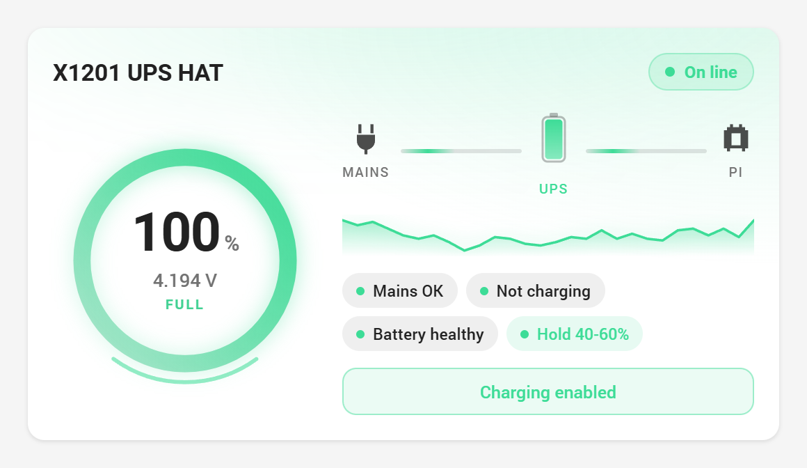
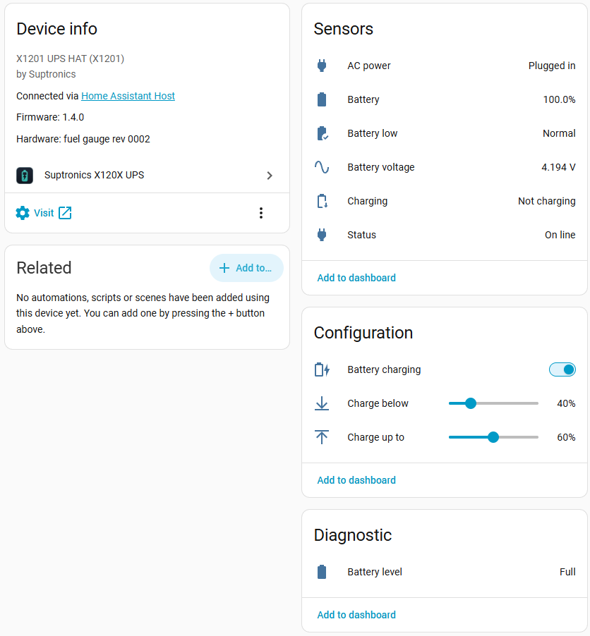
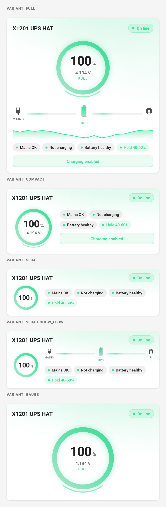
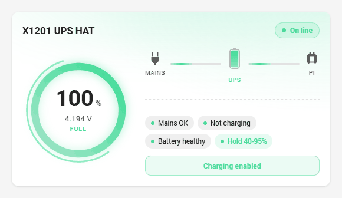

# Suptronics X120X UPS — Home Assistant integration

Custom integration for the Suptronics **X12xx** UPS HATs on a Raspberry Pi. It
reads the fuel gauge over I2C and the HAT's GPIO lines directly from the Home
Assistant instance running on the same Pi.

The hardware protocol was derived from the vendor's own example scripts in
[suptronics/x120x](https://github.com/suptronics/x120x) and from the
["X12xx UPS board" software page](https://suptronics.com/Raspberrypi/Power_mgmt/x120x-v1.0_software.html)
that Suptronics links from every board in the range.



---

## Supported boards

Suptronics ships one set of scripts and one software page for the whole X12xx
range, and it documents a single protocol: a Maxim fuel gauge at I2C `0x36`,
power-loss detection on GPIO 6, charge control on GPIO 16. So the integration
covers all of them:

| Board | Battery | Output | Notable |
|---|---|---|---|
| **X1200** | 2× 18650 | 5.1 V 5 A | the classic; this is the one developed against |
| **X1201** | 2× 18650 | 5.1 V 5 A | XH2.54 connector for an external pack |
| **X1202** | 4× 18650 | 5.1 V 5 A | two USB sockets, XH2.54 out |
| **X1203** | external, XH2.54 | 5.1 V 5 A | no holder: bring your own pack |
| **X1205** | 2× 21700 | 5.1 V 6 A | |
| **X1206** | 4× 21700 | 5.1 V 6 A | up to 20 000 mAh |
| **X1207** | 1× 21700 | 5.1 V 5 A | powered over PoE, 802.3af/at |
| **X1208** | 1× 21700 | 5.1 V 5 A | M.2 2280 NVMe socket on board |
| **X1209** | external, XH2.54 | 5.1 V 6 A | 5–18 V input |

Pick the board in the config flow: it only sets the model name and the product
link on the device, never how the hardware is read. Every reading is the same
on all of them.

The **X12-A1** is not in the list because there is nothing to read: it is a
battery holder, with no fuel gauge and no GPIO of its own.

> Only the X1200 has been verified against real hardware. The rest follow the
> vendor's own documentation for the family; if a board of yours turns out to
> differ, the bus, the address and both pins can be overridden in the config
> flow — and an [issue](https://github.com/mesgas/Suptronics-X120x-homeassistant/issues)
> saying which board and what it does would be welcome.

---

## What it creates

A complete **device** in the Home Assistant registry — manufacturer, model,
fuel gauge revision, a link to the product page, and stacked under the host
when Home Assistant knows about it — with these entities:



| Entity | Type | Notes |
|---|---|---|
| Status | `sensor` (enum) | `online` · `charging` · `on_battery` · `low_battery` |
| Battery | `sensor` | percentage, `device_class: battery` |
| Battery voltage | `sensor` | volts, 3 decimals |
| Battery level | `sensor` (enum, diagnostic) | band derived from cell voltage |
| AC power | `binary_sensor` | `device_class: plug`, from GPIO 6 |
| Charging | `binary_sensor` | `device_class: battery_charging` |
| Battery low | `binary_sensor` | configurable threshold |
| Battery charging | `switch` | enables or disables charging (GPIO 16) |
| Charge up to | `number` | upper end of the charge window |
| Charge below | `number` | lower end of the charge window |

### The charge window

The two `number` entities define a range with **hysteresis**, enforced by the
integration itself: charging stops at the upper limit and only resumes once the
level has fallen back to the lower one. Set them to `60` and `80` and the pack
stays in the band that slows its ageing — **without writing any automation**.

The *Battery charging* switch is the outer gate: with it off the pack never
charges, whatever the window says. The defaults (95–100%) match the board's
normal behaviour.

---

## How the hardware works

| What | Where | Detail |
|---|---|---|
| Cell voltage | I2C `0x36`, register `0x02` | big-endian word, 1.25 mV per LSB / 16 |
| State of charge | I2C `0x36`, register `0x04` | big-endian word, 1/256 % per LSB |
| Mains present | GPIO 6 (BCM) | high means the adapter is supplying power |
| Charge enable | GPIO 16 (BCM) | pull-down enables charging, pull-up stops it |

The charge pin is not driven as an output: the board reads the level produced
by the **internal bias** of the pin configured as an input. That is why the
integration holds the GPIO line request open for its whole life — release it
and the kernel restores the default bias, so the board goes back to charging.

### Why not `gpiod`

Home Assistant OS runs on Alpine (musl) and the `gpiod` wheels published on
PyPI are glibc-only. The integration therefore talks to the kernel's GPIO
character device (`/dev/gpiochipN`, uAPI v2) directly through `ioctl` in pure
Python: nothing to compile. The only requirement is `smbus2`, which is pure
Python as well.

The gpiochip carrying the 40-pin header is found by the **label** of its pin
controller (`pinctrl-rp1` on a Pi 5, `pinctrl-bcm2711` on a Pi 4, and so on)
rather than by number, because the numbering changes between board revisions
and kernels: on the Pi 5 the header moved from `gpiochip4` to `gpiochip0`.

---

## Installation

### With HACS

[](https://my.home-assistant.io/redirect/hacs_repository/?owner=mesgas&repository=Suptronics-X120x-homeassistant&category=integration)

Until the repository is in the default store, add it as a custom repository:
HACS → top-right menu → *Custom repositories* → paste this repository's URL,
category **Integration**.

Then install *Suptronics X120X UPS* and restart Home Assistant.

### By hand

Copy `custom_components/x120x/` into your `config/` directory and restart.

### Enabling I2C

`/dev/i2c-1` has to exist. On **Home Assistant OS**, add this to `config.txt`
on the boot partition:

```
dtparam=i2c_arm=on
```

and reboot. On Raspberry Pi OS, `sudo raspi-config` → *Interface Options* →
*I2C*.

### Configuration

*Settings → Devices & services → Add integration → Suptronics X120X UPS*.

The defaults match the stock wiring. The config flow actually opens the bus and
claims the GPIO lines before creating the device, so anything wrong is reported
straight away rather than later.

The **options** cover the polling interval, the low battery threshold and the
bias of the power-loss pin.

---

## The dashboard card

The integration serves an animated Lovelace card and **adds it to your
dashboard resources by itself** — you will find it under *Settings →
Dashboards → Resources*, and it is removed again together with the last UPS.
It shows up in the card picker as *X120X UPS*, or in YAML:

```yaml
type: custom:x120x-ups-card
```

It needs no configuration: it finds the X120X device and recognises its
entities by device class, so it keeps working after a rename or in another
language. It draws the charge ring with the configured window as an outer arc,
a cell filling with animated liquid, the energy flow mains → UPS → Pi, a
sparkline of the level and the charge button. Every element opens the
more-info dialog of the matching entity.

The sparkline reads the last 24 hours from the recorder, so it has a trace the
moment the card opens rather than only after the level has moved. `hours`
changes the window; with no recorder it falls back to the values seen while the
dashboard is open.

### Four sizes

The same card in four cuts, through `variant`:

| `variant` | Shows | For |
|---|---|---|
| `full` *(default)* | ring, energy flow, sparkline, chips, button | a main panel |
| `compact` | ring, chips, button | a column of cards |
| `slim` | small ring and chips, one row | a dense summary |
| `gauge` | the dial alone, large and centred | a square tile in a grid |

```yaml
type: custom:x120x-ups-card
variant: compact
```



Every block can still be forced on or off regardless of the variant, through
`show_flow`, `show_sparkline`, `show_chips` and `show_button`. For instance the
compact one **with** the energy flow diagram:

```yaml
type: custom:x120x-ups-card
variant: slim
show_flow: true
```

or the large dial with the status chips:

```yaml
type: custom:x120x-ups-card
variant: gauge
show_chips: true
```

An unknown `variant` is rejected with the list of the valid ones, rather than
producing some arbitrary layout.

### Animations



Mains lost, the pack draining, the low-battery threshold crossed, then charging
again: the tint, the ring, the chips and the glow all follow the state.

Everything that moves carries information, and nothing loops without a reason:

- the percentage **counts** up to its new value instead of snapping to it;
- the ring fills with an interpolation, and a spark travels its edge only while
  charging is actually happening;
- the cell releases bubbles and shows the bolt only while charging;
- the flow lanes pulse towards the Pi; the mains lane goes quiet in a blackout;
- the glow breathes only when the battery is critical;
- the card assembles itself with a brief entrance on first paint.

The layout responds to the **width of the card**, not of the window
(`@container`): a narrow card in a column of a wide screen still switches to
the stacked layout. With `prefers-reduced-motion` every animation is disabled.

### How the card is loaded

As a Lovelace **resource**, exactly as if you had added it by hand. Earlier
releases injected it into the frontend page instead, and that page is cached
— by the browser's service worker and, wholesale, by the companion apps — so
a client holding an old copy could report `Custom element doesn't exist:
x120x-ups-card` on an integration that was working perfectly. Resources are
not part of the page: every dashboard asks the server for them each time it
opens.

If your dashboards are in **YAML mode** there is no resource store to write
to, and the card falls back to injection. In that case you can add it to your
`resources:` yourself, which is the more reliable of the two:

```yaml
lovelace:
  resources:
    - url: /x120x_static/x120x-ups-card.js
      type: module
```

### All the options

```yaml
type: custom:x120x-ups-card
variant: full           # full | compact | slim | gauge
hours: 24               # how far back the sparkline looks
name: Rack UPS          # custom title
device_id: abc123...    # only when more than one X120X is configured
entities:               # explicit overrides, all optional
  capacity: sensor.x1200_ups_battery
  voltage: sensor.x1200_ups_battery_voltage
  status: sensor.x1200_ups_status
  level: sensor.x1200_ups_battery_level
  ac: binary_sensor.x1200_ups_ac_power
  charging: binary_sensor.x1200_ups_charging
  low: binary_sensor.x1200_ups_battery_low
  charge_switch: switch.x1200_ups_battery_charging
```

---

## A useful automation

A clean shutdown when the mains fail and the battery runs down. The integration
never shuts the Pi down on its own — that call stays yours:

```yaml
automation:
  - alias: Shut the Pi down on a flat UPS
    triggers:
      - trigger: numeric_state
        entity_id: sensor.x1200_ups_battery
        below: 15
        for: "00:01:00"
    conditions:
      - condition: state
        entity_id: binary_sensor.x1200_ups_ac_power
        state: "off"
    actions:
      - action: hassio.host_shutdown
```

---

## Icons

The **entity** icons live in `custom_components/x120x/icons.json` and follow
the state: the plug unplugs when the mains fail, the battery goes from full to
alarm, the switch shows whether charging is permitted.

The **brand** icon — the one in the integrations list — is in
`custom_components/x120x/brand/`:

```
brand/icon.png       256 x 256
brand/icon@2x.png    512 x 512
```

Since Home Assistant **2026.3** a custom integration carries its own brand
images inside its own folder, and the core serves them through the Brands Proxy
API (`/api/brands/integration/x120x/icon.png`). Pull requests to
[home-assistant/brands](https://github.com/home-assistant/brands) are no longer
accepted for custom components, so there is nothing to submit anywhere: copy
the integration and the icon comes with it.

On versions before 2026.3 the folder is simply ignored and the generic icon
appears. That is cosmetic only and changes nothing about how the integration
works.

To regenerate them:

```bash
python3 tools/make_brand_icons.py
```

They are drawn full bleed, with no transparent border, and the script checks
both the dimensions and the absence of a border itself. Should a dark-background
variant ever be needed, the expected names are `dark_icon.png` and
`dark_icon@2x.png`.

---

## Diagnostics

### Before installing: `tools/x120x_probe.py`

A standalone script with **no dependencies at all** — standard library only, so
it needs neither `libgpiod` nor `gpiodetect` nor `smbus2` nor `pip`. Copy it
wherever you want to know what that context can see — the SSH add-on, the Home
Assistant container, a plain Raspberry Pi OS shell — and run it:

```bash
python3 x120x_probe.py
```

It prints every `/dev/gpiochip*` with its **label** and line count, says which
one is the 40-pin header, reads the power-loss pin and queries the fuel gauge.
It only reads; nothing is written to the board.

### Once installed

From the device page, *Download diagnostics*: the file lists the readings, the
charge window and **every `/dev/i2c-*` and `/dev/gpiochip*` as seen by Home
Assistant itself**, with labels and line counts. It is the quickest way to tell
whether the container can see the hardware at all.

---

## Known limits

- The fuel gauge exposes no current, so *Charging* is inferred: mains present
  **and** charging permitted **and** the pack not already full.
- The board offers no read-back for the charge pin: the integration remembers
  the last value it wrote and restores it on restart.
- Removing or reloading the integration releases the GPIO lines, and the board
  returns to its default, which is charging enabled.

---

## Licence

[MIT](LICENSE).

This integration is neither affiliated with nor endorsed by Suptronics.
